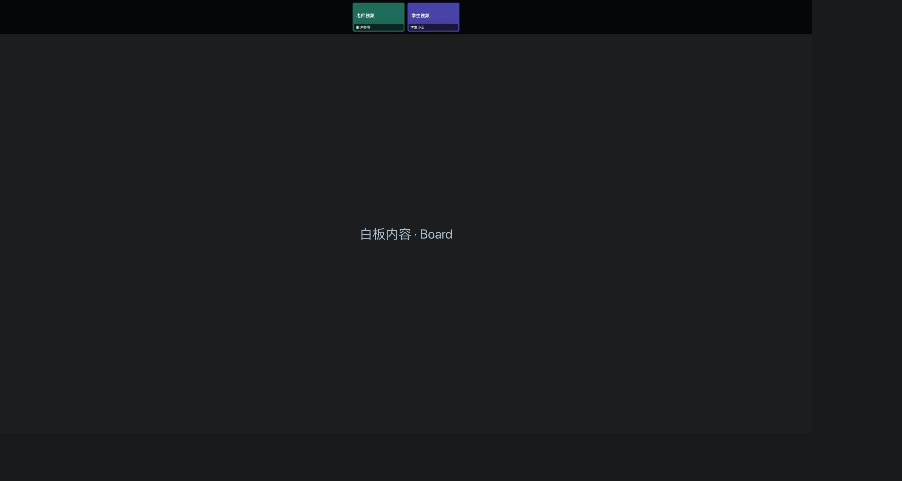
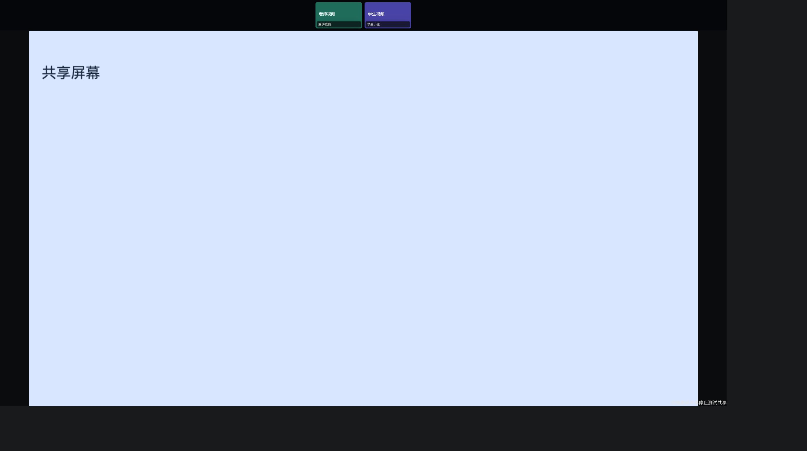

# 录制画面停留在白板加载页、缺少参与者视频

日期：2026-10-02。范围：Agora 网页合成录制页；本轮尚未提交、推送或部署。

## 已定位的问题

1. 录制页的课堂状态轮询复用了初始入场接口。该接口会重新申请 Netless 白板凭证，`roomToken` 变化又触发 `FastboardSurface` 清理并重建白板。启动中的轮询间隔只有 2 秒，白板尚未加载完成就可能再次重建；即使已加载完成，后续轮询也会重复显示加载页。
2. 录制专用 CSS 隐藏了整个讲台视频区。只有老师手动放到白板上的摄像头才进入合成画面，普通讲台摄像头虽然已订阅，却没有可见的录制区域。
3. 就绪检查把白板凭证不可用当成“无需等待白板”，只检查 RTC 已连接，没有等待可见视频解码首帧。此外，服务器返回 HTTP 202（录制服务仍在准备）也被 `response.ok` 当成成功，导致录制页停止重试。频繁的课堂状态更新还可能反复重启就绪等待计时器。

上述路径已经通过代码和本地模拟浏览器验证。尚未收到异常回放链接，未核对该历史录制的生产日志，因此不把它们表述为某一历史文件的唯一原因。

## 修复

- 增加独立的 `/api/classroom/recorder/state` 内容轮询接口，查询已有课堂状态，不重新签发 RTC 或白板入场凭证。访问必须携带绑定课次和录制 ID 的签名令牌，并匹配对应网页录制记录。
- 录制页独立渲染老师及台上学生的摄像头。白板已经包含的摄像头避免重复；共享屏幕盖住白板时，摄像头仍保留在录制区。辅助摄像头保持现有独立逻辑。
- 白板凭证失败时允许录制页通过签名令牌重新申请只读凭证。后台读课件使用教师可见范围，以包含教学舞台上的课件；录制身份仍不能操作白板或管理课堂。
- 白板是当前舞台内容时，必须等待白板就绪；共享或摄像头舞台不依赖白板。可见视频必须已有解码帧。就绪等待依赖实际可录制状态，避免被无关快照更新反复取消。
- 仅在服务器返回 HTTP 200 且 `state: "ready"` 后完成放行，HTTP 202 保持重试。

涉及代码：

- `src/components/classroom/classroom-v3.tsx`
- `src/app/classroom-classin.css`
- `src/app/api/classroom/recorder/state/route.ts`
- `src/app/api/classroom/session/route.ts`
- `src/app/api/classroom/session/whiteboard-credential/route.ts`
- `src/lib/classroom/server/recorder-access.ts`
- `src/lib/classroom/recorder-surface.ts`
- `src/lib/classroom/recording-start.ts`

## 本地验证

- 工作区 `npm test`：118 项通过，包括摄像头选择、解码首帧、就绪状态和录制接口签名校验回归。
- 提交前隔离本轮课堂反馈和录制修复，排除桌面端、辅助摄像头、课堂活动等其他未提交改动；独立提交版本 `npm test`：111 项通过，TypeScript 和相关文件 ESLint 通过。
- `npx tsc --noEmit`、相关文件 ESLint、`git diff --check`：通过。
- `npm run build`：通过。
- Chrome 使用真实组件、模拟 RTC/Netless/服务端接口，视频元素使用 Canvas MediaStream，实际解码帧；每 250 毫秒推送媒体快照，验证就绪等待不被无关更新打断。

| 场景 | 观察结果 |
| --- | --- |
| 持续状态轮询 | 53 次内容刷新，初始入场 1 次、白板创建 1 次、销毁 0 次 |
| 网页合成画面 | 白板与两路视频同时可见，两路视频均解码为 320×180 |
| HTTP 202 后就绪 | 首次通知约 3.40 秒，约 4.91 秒再次请求成功；原生就绪通知仅 1 次 |
| 凭证缺失、视频延迟 5 秒 | 只读凭证重试 1 次；约 5.95 秒视频首帧就绪后放行 |
| 白板 SDK 加载失败 | 122 次轮询后仍未发出原生或服务端就绪通知 |
| 共享屏幕开启并关闭 | 共享视频解码为 1280×720；两路摄像头一直保留；切回白板仍只创建过 1 次 |

模拟验证的截图与计数保存在 `docs/validation/classroom-recorder-2026-10-02/`。这些证据不代表真实云端录制服务已生成、停止并最终产出可播放文件。

## 部署后验收边界

使用新的测试课堂验证老师和台上学生打开摄像头、绘制白板、切换共享屏幕，完成停止录制及文件最终生成；重新开始第二段录制，并确认两段回放顺序和视频、声音均正确。当前未进行该真实服务验收。

这次修复作用于后续录制，旧录像中已经缺失的画面不会自动补回。本次录制修复不包含数据库结构变更；工作区同时存在的课堂活动、桌面端等其他改动未作为本次录制修复的交付内容。
